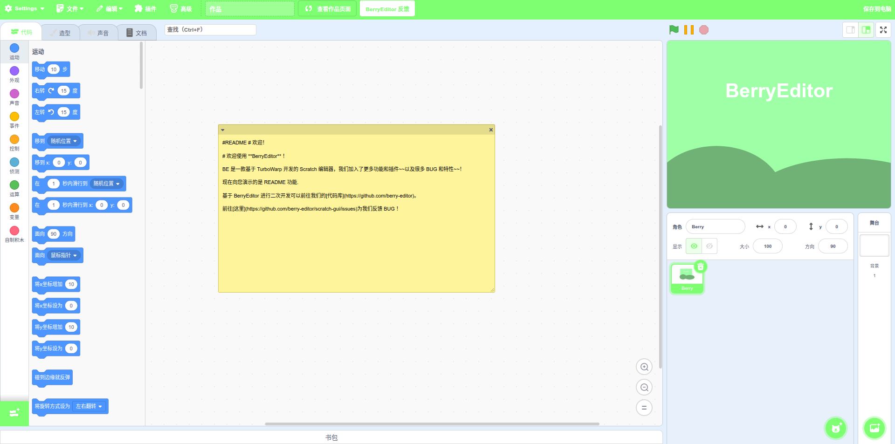

# BerryEditor更新日志
目前更改了各种各样的东西，还加了一个扩展库，想要添加扩展请前往 https://github.com/berrt-editor/extensions/issues/

## 目前效果图：

## 更新内容

1. 初始角色（图1）
2. 作品文档（Markdown） 需要在作品中有带有`#README`的注释 （图2），文案来自于`AstraEditor`
3. 扩展库（图3）
4. 颜色主题（新增`BE绿`和`天依蓝`）

***

## 加入开发和反馈

E-mail：1350519334@qq.com

**或**

QQ:     1350519334

***
